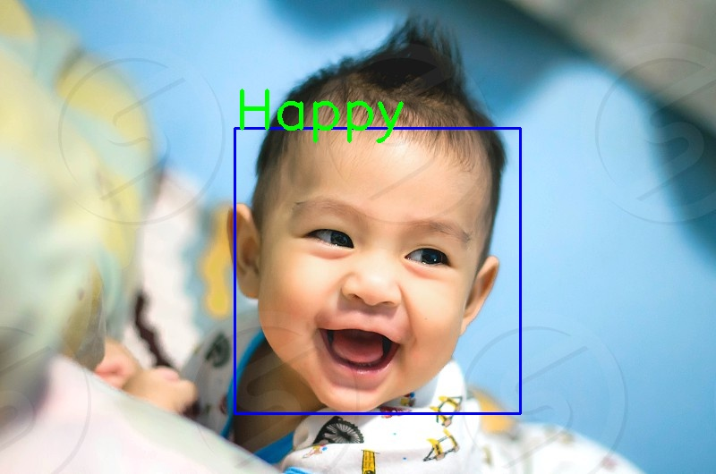

# Facial-Expression-Prediction

      
   
   One of the most exiciting feild in Artificial Intelligence is working with images and video(Video is nothing but set of images). I wanted to do image classification. One of such project is Facial Expression classification.
   
The aim of the project is build a Deep learning network model to train and predict expression of an image and live stream video.
 
1.Image agumentation (Data preparation)                                                                                            2.Design Convulution Neural network
3.Train the images and get train weights of h5 file
4.Use trained weights for prediction

Tools used: 
       python notebook, Keras and openCV.
       
 

       
        
       
           

      
